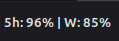
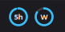
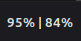
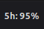

# Gemini AI Quota Widget (Spice) for Cinnamon

A lightweight Cinnamon desktop panel applet that monitors your Google Gemini AI **5-hour rolling limit** and **weekly quota** in real time.


## Features

- **Glanceable Panel Display:** Shows remaining percentages directly on your panel (e.g., `5h: 86% | W: 87%`).
- **Interactive Popup Menu:**
  - Modern cards with circular donut/torus charts or linear progress bars.
  - Visual color-coded indicators (Normal, Amber warning, Red critical).
  - Exact time until refresh (e.g. `Resets in 4h 38m (Fri 03:25 PM)`).
  - Live status indicator (Active / Offline).
  - One-click **Refresh Now** button.
- **Customizable Appearance:**
  - Multiple panel display modes: standard text, donut rings with text, donut rings only, compact, 5h-only, weekly-only, or icon-only.
  - Toggleable Gemini sparkle icon and prefix.
  - Configurable update interval (default: 60s).
  - Low-quota desktop notifications with custom thresholds.
- **High Performance & Privacy:**
  - Queries the local Antigravity language server via secure loopback RPC.
  - Zero external npm/pip dependencies (uses pure Python standard library & Cinnamon GJS).
  - Completely non-blocking asynchronous execution.

---

## Screenshots & Visual Styles

### Popup Menu & Settings

|    Interactive Hover / Popup Card     |         Preferences & Configuration         |
| :-----------------------------------: | :-----------------------------------------: |
|  |  |

### Panel Display Styles

Choose how your quota is displayed directly on your Cinnamon panel:

| Style                          |                        Panel Preview                         | Description                                      |
| :----------------------------- | :----------------------------------------------------------: | :----------------------------------------------- |
| **Donuts with Icon (Default)** |  | Circular progress rings with the Gemini icon     |
| **Standard Text**              |                          | 5h and weekly percentages with labels            |
| **Donut Rings & Text**         |    | Circular progress rings with text                |
| **Donut Rings Only**           |            | Circular progress rings only                     |
| **Compact Text**               |                 | Just percentage values separated by a divider    |
| **5-Hour Only**                |                         | Only your active 5-hour rolling limit percentage |
| **Weekly Only**                |                      | Only your active weekly limit percentage         |
| **Icon Only**                  |                          | If you only want the hovercard                   |

---

## Installation

### Quick Install & Enable

Run the included installation script from the project folder:

```bash
cd ~/Documents/cinnamon-gemini-widget
./install.sh enable
```

This installs the applet files to `~/.local/share/cinnamon/applets/gemini-quota@antigravity` and automatically adds it to your panel.

### Manual Activation via System Settings

If you prefer to add it manually:

1. Run `./install.sh install`
2. Open **System Settings** -> **Applets**
3. Select **Gemini AI Quota**
4. Click **+** to add it to your panel

---

## Configuration

Right-click the applet in your panel and select **Configure...** to customize:

- **Panel Display Style:** Choose between Standard Text, Donut Rings with Text, Donut Rings Only, Compact Text, 5h-only, Weekly-only, or Icon-only.
- **Popup Card Style:** Choose between circular Donut/Torus charts, linear Progress Bars, or both.
- **Panel Icon & Prefix:** Toggle the Gemini sparkle icon and optional `Gemini:` label prefix.
- **Update Frequency:** Set polling interval between 15 and 600 seconds (default: 60s).
- **Thresholds & Notifications:** Set custom warning (amber) and critical (red) thresholds, plus desktop notifications when quota runs low.

---

## Commands

```bash
# Check current quota in terminal
./install.sh status

# Re-install files after updates
./install.sh install

# Remove from Cinnamon panel and delete files
./install.sh uninstall
```

---

## Architecture

```
cinnamon-gemini-widget/
├── metadata.json           # Cinnamon applet manifest
├── applet.js               # Cinnamon GJS applet implementation
├── stylesheet.css          # Modern styling for popup cards & progress bars
├── settings-schema.json    # Native Cinnamon settings GUI definition
├── probe.py                # Fast Python loopback probe for Antigravity RPC
├── icon.svg                # Vector Gemini sparkle icon
├── icon.png                # 48x48 icon for panel and notification tray
├── install.sh              # One-command installer & panel manager
└── README.md               # Documentation
```
